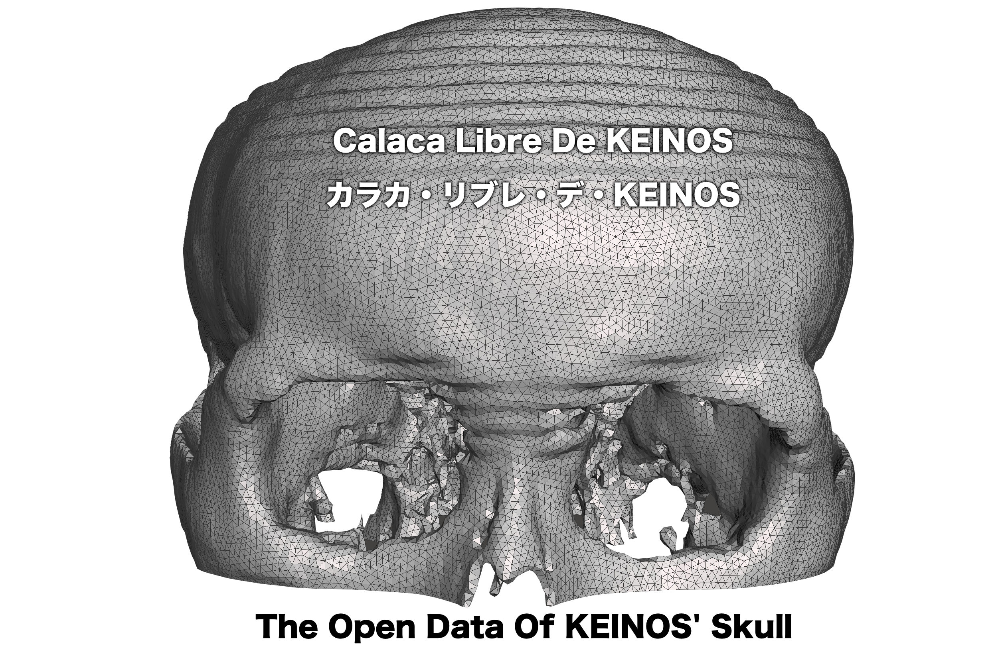

# CALACA LIBRE DE KEINOS

The Open Data of KEINOS' CT scanned head 2D images and 3D skull models.

```text
.
├── LICENSE    // MIT. But do what ever you want with your creation.
├── README.md  // This file
├── 2D         // The original CT scanned data of KEINOS' head
│   ├── DCM      // OsiriX DICOM format (Axial 4.0)
│   └── TIFF     // TIFF format
├── 3D
│   ├── DXF   // Drawing eXchange Format
│   ├── FBX   // Filmbox FBX v2012/v2015 format
│   ├── MIX   // Autodesk Meshmixer MIX format
│   ├── OBJ   // Obj format with no color-per-vertex extension
│   ├── STL   // STL format 3D model in Bin and ASCII
│   ├── SVG   // Illustrator SVG Format
│   ├── VRML  // Version 2.0 utf8 WRL/VRML files
│   └── X3D   // ISO 19776 XML Format
└── TitleImage.png
```

- NOTE: Since the 2D images are not taken in equally spaced intervals, the 3D images are not isotropic. Meaning, the aspect ratio may be wrong.